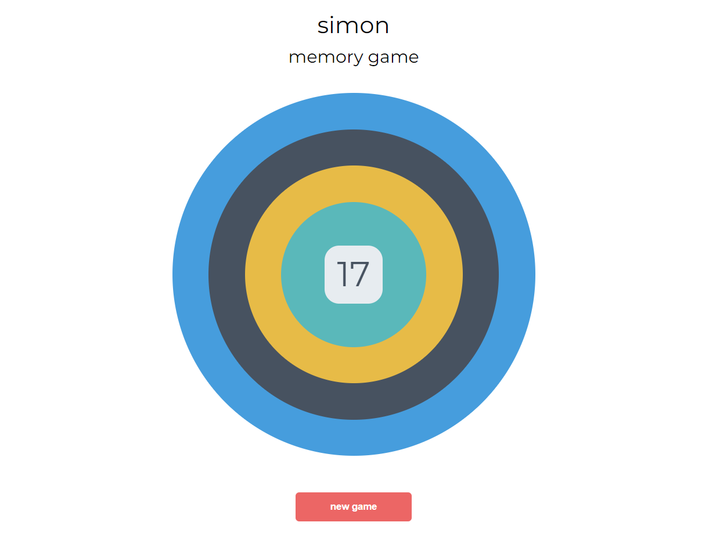
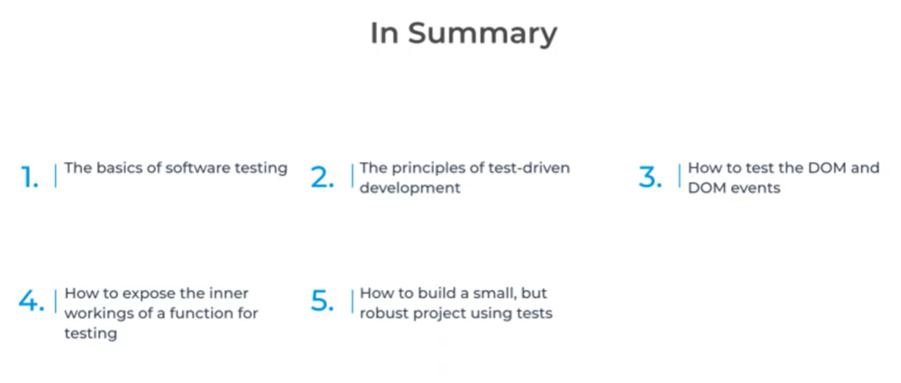

# Simon memory game
A project built with focus on using JavaScript JEST testing framework as part of Full Stack Diploma in Software Development with Code Institute.

[Link to deployed project](https://aleksandracodes.github.io/Simon-memory-game/)

## Learning outcomes

